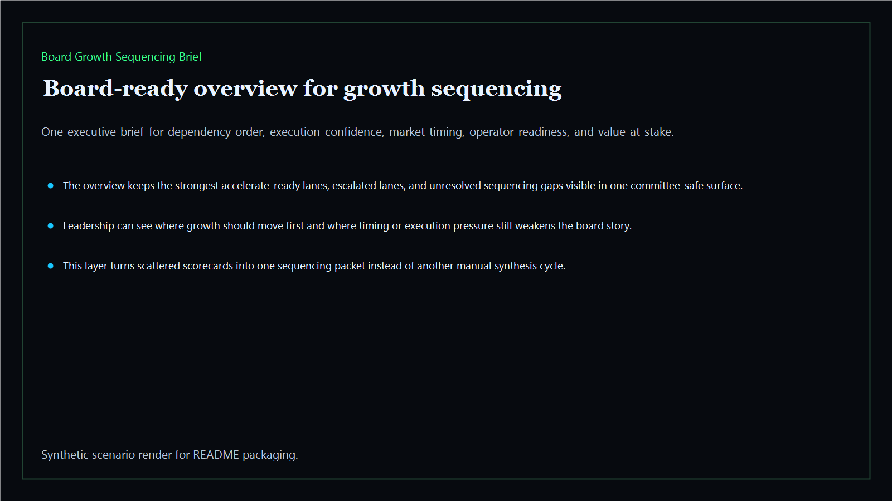
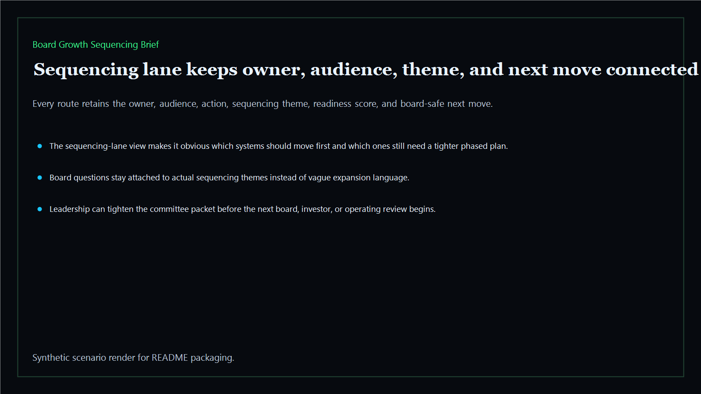
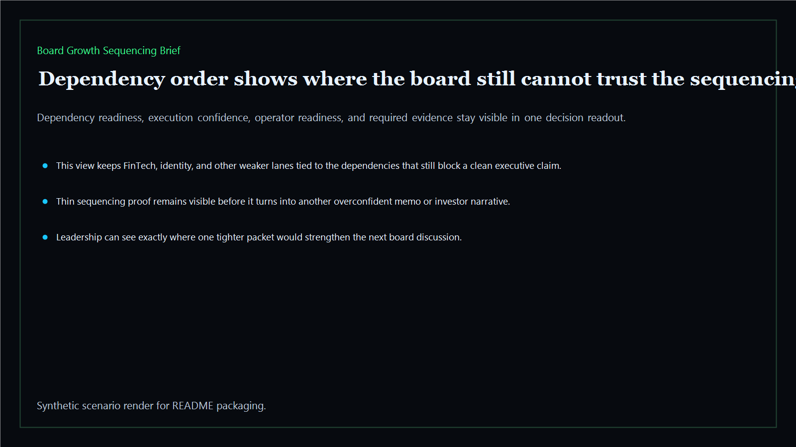
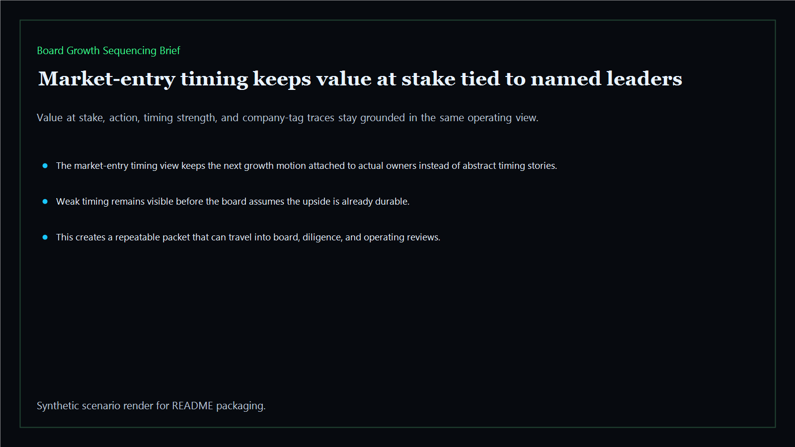

# Board Growth Sequencing Brief

Board-ready growth sequencing brief for expansion pacing, dependency order, capacity unlocks, and board-safe market-entry timing across the executive estate.

- Live: `https://sequence.kineticgain.com/`
- Repo: `mizcausevic-dev/board-growth-sequencing-brief`

## Why this matters

Leaders need more than a broad expansion ambition. They need one sequencing brief that shows which moves should come first, which dependencies still block scale, where capacity unlocks exist, and when the board should accelerate, defer, or stage growth in phases.

## What it includes

- TypeScript executive-intelligence surface for growth sequencing with modeled dependency chains, capacity unlocks, pacing risks, and board-safe expansion posture
- synthetic executive lanes across AI, identity, revenue, FinTech, biotech, procurement, and public-sector readiness
- reusable outputs for sequencing briefs, dependency maps, pacing packets, and board-ready expansion memos
- prerendered static site, JSON payloads, screenshots, and docs

## Routes

- `/`
- `/sequencing-lane`
- `/dependency-order`
- `/market-entry-timing`
- `/verification`
- `/docs`

## Local run

```bash
cd board-growth-sequencing-brief
npm install
npm run verify
npm run prerender
npm run render:assets
```

## CLI

```bash
npx board-growth-sequencing-brief fixtures/board-growth-sequencing-brief.json --format summary
npx board-growth-sequencing-brief fixtures/board-growth-sequencing-brief-clean.json --format json
```

## Docs

- [Architecture](docs/architecture.md)
- [Origin](docs/ORIGIN.md)
- [Kinetic Gain Embedded](docs/KINETIC_GAIN_EMBEDDED.md)

## Screenshots






